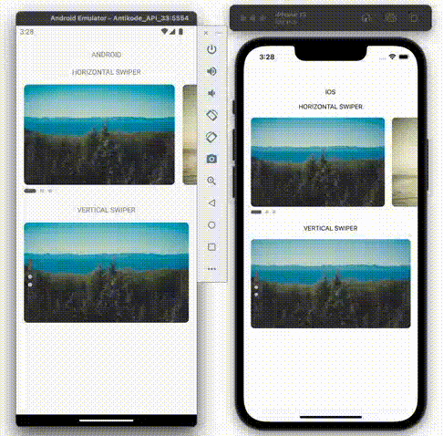

## Horizontal & Vertical Swiper



```javascript
...
import AntiSwiper from 'react-native-antiswiper';

const App = () => {
  const { width } = useWindowDimensions();
  const horizontal = { width: 300, height: 200 }
  const vertical = { width: width - 16 * 2, height: 200 }
  const [indexHorizontal, setIndexHorizontal] = React.useState(0);
  const [indexVertical, setIndexVertical] = React.useState(0);

  const data = [
    `https://picsum.photos/id/10/300/200`,
    `https://picsum.photos/id/100/300/200`,
    `https://picsum.photos/id/1002/300/200`
  ];

  const renderItemHorizontal = ({ item, index }) => {
    return (
      <View
        style={{
          width: horizontal.width,
          height: horizontal.height,
        }}>
        <Image
          source={{ uri: item }}
          style={{ width: horizontal.width, height: horizontal.height, borderRadius: 8 }}
          resizeMode={'cover'}
        />
      </View>
    );
  };

  const renderItemVertical = ({ item, index }) => {
    return (
      <View
        style={{
          width: vertical.width,
          height: vertical.height,
        }}>
        <Image
          source={{ uri: item }}
          style={{ width: vertical.width, height: vertical.height, borderRadius: 8 }}
          resizeMode={'cover'}
        />
      </View>
    );
  };

  return (
    <SafeAreaView style={{ flex: 1 }}>
      <StatusBar
        translucent
        backgroundColor={'transparent'}
        barStyle={'dark-content'}
      />
      <View style={{ paddingTop: 32, alignItems: 'center' }}>
        <Text style={{ marginTop: 16, textTransform: 'uppercase' }}>{`${Platform.OS}`}</Text>
        <Text style={{ marginVertical: 16, textTransform: 'uppercase' }}>{`Horizontal swiper`}</Text>
        <AntiSwiper
          data={data}
          renderItem={renderItemHorizontal}
          width={horizontal.width}
          height={horizontal.height}
          auto={true}
          duration={3000}
          space={16}
          spaceLastItem={true}
          horizontal={true}
          contentContainerStyle={{ marginHorizontal: 16 }}
          indicatorStyle={{ marginHorizontal: 12 }}
          index={indexHorizontal}
          setIndex={setIndexHorizontal}
        />
        <Text style={{ marginVertical: 16, textTransform: 'uppercase' }}>{`vertical swiper`}</Text>
        <AntiSwiper
          data={data}
          renderItem={renderItemVertical}
          width={vertical.width}
          height={vertical.height}
          auto={true}
          duration={3000}
          space={16}
          dotActiveHeight={24}
          dotActiveWidth={8}
          horizontal={false}
          contentContainerStyle={{ marginHorizontal: 16 }}
          indicatorStyle={{ marginHorizontal: 16, position: 'absolute', left: 8, height: vertical.height, justifyContent: 'center' }}
          index={indexVertical}
          setIndex={setIndexVertical}
        />
      </View>
    </SafeAreaView>
  );
};
```
