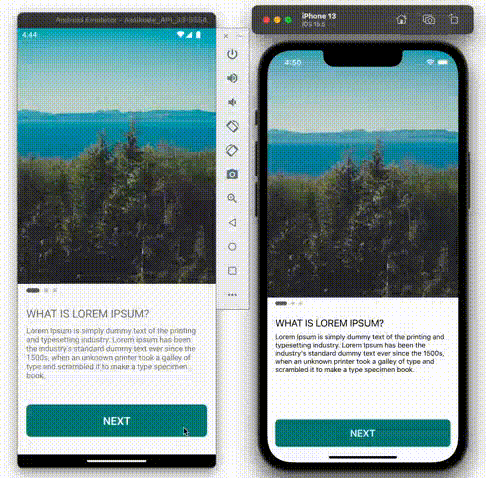

## Horizontal & Vertical Swiper


## Code

```javascript
...
import AntiSwiper from 'react-native-antiswiper';

const App = () => {
  const { width } = useWindowDimensions();
  const horizontal = { width: 300, height: 200 }
  const vertical = { width: width - 16 * 2, height: 200 }
  const [indexHorizontal, setIndexHorizontal] = React.useState(0);
  const [indexVertical, setIndexVertical] = React.useState(0);

  const data = [
    `https://picsum.photos/id/10/300/200`,
    `https://picsum.photos/id/100/300/200`,
    `https://picsum.photos/id/1002/300/200`
  ];

  const renderItemHorizontal = ({ item, index }) => {
    return (
      <View
        style={{
          width: horizontal.width,
          height: horizontal.height,
        }}>
        <Image
          source={{ uri: item }}
          style={{ width: horizontal.width, height: horizontal.height, borderRadius: 8 }}
          resizeMode={'cover'}
        />
      </View>
    );
  };

  const renderItemVertical = ({ item, index }) => {
    return (
      <View
        style={{
          width: vertical.width,
          height: vertical.height,
        }}>
        <Image
          source={{ uri: item }}
          style={{ width: vertical.width, height: vertical.height, borderRadius: 8 }}
          resizeMode={'cover'}
        />
      </View>
    );
  };

  return (
    <SafeAreaView style={{ flex: 1 }}>
      <StatusBar
        translucent
        backgroundColor={'transparent'}
        barStyle={'dark-content'}
      />
      <View style={{ paddingTop: 32, alignItems: 'center' }}>
        <Text style={{ marginTop: 16, textTransform: 'uppercase' }}>{`${Platform.OS}`}</Text>
        <Text style={{ marginVertical: 16, textTransform: 'uppercase' }}>{`Horizontal swiper`}</Text>
        <AntiSwiper
          data={data}
          renderItem={renderItemHorizontal}
          width={horizontal.width}
          height={horizontal.height}
          auto={true}
          duration={3000}
          space={16}
          spaceLastItem={true}
          horizontal={true}
          contentContainerStyle={{ marginHorizontal: 16 }}
          indicatorStyle={{ marginHorizontal: 12 }}
          index={indexHorizontal}
          setIndex={setIndexHorizontal}
        />
        <Text style={{ marginVertical: 16, textTransform: 'uppercase' }}>{`vertical swiper`}</Text>
        <AntiSwiper
          data={data}
          renderItem={renderItemVertical}
          width={vertical.width}
          height={vertical.height}
          auto={true}
          duration={3000}
          space={16}
          dotActiveHeight={24}
          dotActiveWidth={8}
          horizontal={false}
          contentContainerStyle={{ marginHorizontal: 16 }}
          indicatorStyle={{ marginHorizontal: 16, position: 'absolute', left: 8, height: vertical.height, justifyContent: 'center' }}
          index={indexVertical}
          setIndex={setIndexVertical}
        />
      </View>
    </SafeAreaView>
  );
};
```

## OnBoarding Swiper



## Code

```javascript
...
import AntiSwiper from 'react-native-antiswiper';

const App = () => {
  const { width, height } = useWindowDimensions();
  const horizontal = { width: width, height: height * 0.6 }
  const [index, setIndex] = React.useState(0);

  const data = [
    {
      image: `https://picsum.photos/id/10/500/500`,
      title: `What is Lorem Ipsum?`,
      description: `Lorem Ipsum is simply dummy text of the printing and typesetting industry. Lorem Ipsum has been the industry's standard dummy text ever since the 1500s, when an unknown printer took a galley of type and scrambled it to make a type specimen book.`
    },
    {
      image: `https://picsum.photos/id/100/500/500`,
      title: `Where does it come from?`,
      description: `Contrary to popular belief, Lorem Ipsum is not simply random text. It has roots in a piece of classical Latin literature from 45 BC, making it over 2000 years old.`
    }, {
      image: `https://picsum.photos/id/1002/500/500`,
      title: `Why do we use it?`,
      description: `It is a long established fact that a reader will be distracted by the readable content of a page when looking at its layout.`
    }
  ];

  const renderItemHorizontal = ({ item, index }) => {
    return (
      <View
        style={{
          width: horizontal.width,
          height: horizontal.height,
        }}>
        <Image
          source={{ uri: item?.image }}
          style={{ width: horizontal.width, height: horizontal.height }}
          resizeMode={'cover'}
        />
      </View>
    );
  };

  return (
    <View style={{ flex: 1 }}>
      <StatusBar
        translucent
        backgroundColor={'transparent'}
        barStyle={'light-content'}
      />
      <View style={{ flex: 1 }}>
        <View>
          <AntiSwiper
            data={data}
            renderItem={renderItemHorizontal}
            width={horizontal.width}
            height={horizontal.height}
            auto={false}
            duration={3000}
            space={16}
            spaceLastItem={true}
            horizontal={true}
            indicatorStyle={{ marginHorizontal: 12 }}
            index={index}
            setIndex={setIndex}
          />
        </View>
        <View style={{ padding: 16 }}>
          <Text style={{ textTransform: 'uppercase', fontSize: 20, marginBottom: 8 }}>{data[index].title}</Text>
          <Text style={{ fontSize: 14, marginBottom: 8 }}>{data[index].description}</Text>
        </View>
      </View>
      <View style={{ justifyContent: 'center', alignItems: 'center', paddingBottom: 32 }}>
        <TouchableOpacity
          onPress={() => {
            setIndex(prev => prev != data?.length - 1 ? prev + 1 : prev)
          }}
        >
          <View style={{
            width: width - (16 * 2),
            backgroundColor: index === data?.length - 1 ? 'steelblue' : 'teal',
            paddingVertical: 16,
            justifyContent: 'center',
            alignItems: 'center',
            borderRadius: 8
          }}>
            <Text style={{
              fontSize: 20,
              fontWeight: '600',
              color: 'white'
            }}>{index === data?.length - 1 ? `FINISH` : `NEXT`}</Text>
          </View>
        </TouchableOpacity>
      </View>
    </View>
  );
};
```
