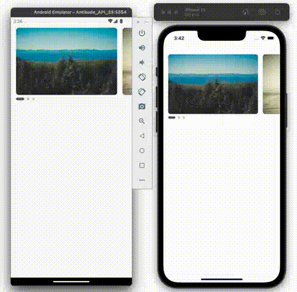

# AntiSwiper

## Installation

with npm :

```shell
  npm i react-native-antiswiper
```

with yarn :

```shell
  yarn add react-native-antiswiper
```

## Usage



```javascript
...
import AntiSwiper from 'react-native-antiswiper';

const App = () => {
  const horizontal = { width: 300, height: 200 }
  const [index, setIndex] = React.useState(0);

  const data = [
    `https://picsum.photos/id/10/300/200`,
    `https://picsum.photos/id/100/300/200`,
    `https://picsum.photos/id/1002/300/200`,
  ];

  const renderItemHorizontal = ({ item, index }) => {
    return (
      <View
        style={{
          width: horizontal.width,
          height: horizontal.height,
        }}>
        <Image
          source={{ uri: item }}
          style={{ width: horizontal.width, height: horizontal.height, borderRadius: 8 }}
          resizeMode={'cover'}
        />
      </View>
    );
  };

  return (
    <SafeAreaView style={{ flex: 1 }}>
      <StatusBar
        translucent
        backgroundColor={'transparent'}
        barStyle={'dark-content'}
      />
      <View style={{ paddingTop: 32, alignItems: 'center' }}>
        <AntiSwiper
          data={data}
          renderItem={renderItemHorizontal}
          width={horizontal.width}
          height={horizontal.height}
          auto={true}
          duration={3000}
          space={16}
          spaceLastItem={true}
          horizontal={true}
          contentContainerStyle={{ marginHorizontal: 16 }}
          indicatorStyle={{ marginHorizontal: 12 }}
          index={index}
          setIndex={setIndex}
        />
      </View>
    </SafeAreaView>
  )
}
```

### Other Example

[HERE](https://github.com/antikode/react-native-antiswiper/blob/main/EXAMPLE.md)

## Contributors

[@Sardi Kapilano](https://www.github.com/sardik) [@Imam Holid](https://www.github.com/im-holid) [@Andika Andriana](https://www.github.com/andika-andriana) [@Rahmat Hidayat](https://www.github.com/rahmat1929)
